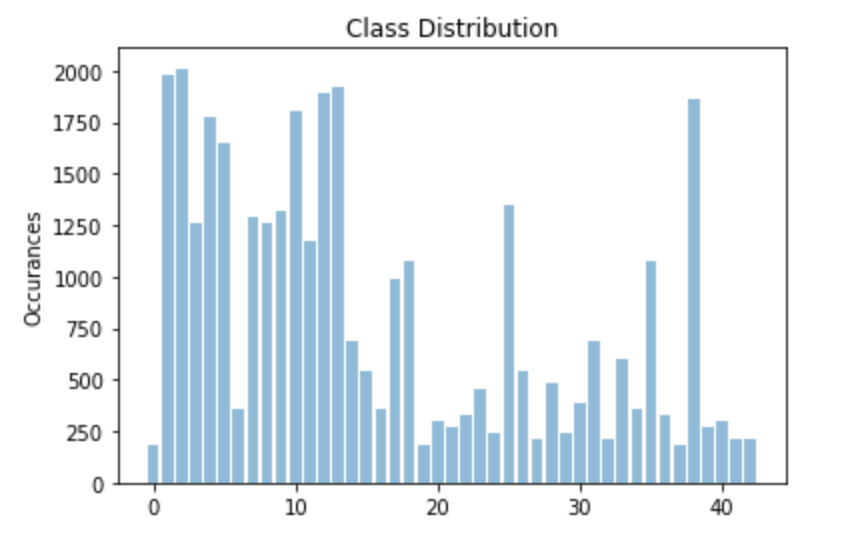
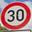
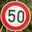
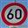
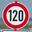

## Rubric Points
### Here I will consider the [rubric points](https://review.udacity.com/#!/rubrics/481/view) individually and describe how I addressed each point in my implementation.  

---
### Writeup / README

#### 1. Provide a Writeup / README that includes all the rubric points and how you addressed each one. You can submit your writeup as markdown or pdf. You can use this template as a guide for writing the report. The submission includes the project code.

You're reading it! and here is a link to my [project code](Traffic_Sign_Classifier.ipynb)

### Data Set Summary & Exploration

#### 1. Provide a basic summary of the data set. In the code, the analysis should be done using python, numpy and/or pandas methods rather than hardcoding results manually.

I used the pandas library to calculate summary statistics of the traffic
signs data set:

* The size of training set is 34799
* The size of the validation set is 4410
* The size of test set is 12630
* The shape of a traffic sign image is (32, 32, 1)
* The number of unique classes/labels in the data set is 43

#### 2. Include an exploratory visualization of the dataset.

To explore the dataset, I created a bar chart that shows the class distribution of the training set.  I was surprised to see that some sign types are much more prevalent in the dataset than others.  

### Design and Test a Model Architecture

#### 1. Describe how you preprocessed the image data. What techniques were chosen and why did you choose these techniques? Consider including images showing the output of each preprocessing technique. Pre-processing refers to techniques such as converting to grayscale, normalization, etc. (OPTIONAL: As described in the "Stand Out Suggestions" part of the rubric, if you generated additional data for training, describe why you decided to generate additional data, how you generated the data, and provide example images of the additional data. Then describe the characteristics of the augmented training set like number of images in the set, number of images for each class, etc.)

After reviewing a sample of images in the dataset, I determined color is a redundant factor in distinguishing between different signs in the dataset.  Since color was immaterial, I converted all the images to grayscale as a preprocessing step.  This reduced the dimensionality of the data allowing the training to converge faster (very helpful since I was using a CPU).  Next I normalized the data.  Gradient decent can favor certain weights if they are on different scales (red channel value of 5 vs 50 for example) and normalization helps reduce this variance and speed up convergence.  In the end data augmentation wasn’t needed because my model performed satisfactorily without it.

#### 2. Describe what your final model architecture looks like including model type, layers, layer sizes, connectivity, etc.) Consider including a diagram and/or table describing the final model.

My final model consisted of the following layers:

| Layer         		|     Description	        					| 
|:---------------------:|:---------------------------------------------:| 
| Input         		| 32x32x1 Grayscale image   					| 
| Convolution 5x6     	| 1x1 stride, same padding, outputs 28x28x6 	|
| RELU					|												|
| Max pooling	      	| 2x2 stride,  outputs 14x14x6 				    |
| Convolution 5x16     	| 1x1 stride, same padding, outputs 10x10x16 	|
| RELU					|												|
| Max pooling	      	| 2x2 stride,  outputs 5x5x16 				    |
| Flatten				| 5x5x16 to 400x1								|
| Fully connected		| 400x1 to 120x1        						|
| RELU					|												|
| Dropout				|												|
| Fully connected		| 120x1 to 84x1        						    |
| RELU					|												|
| Dropout				|												|
| Fully connected		| 84x1 to 43x1        						    |
| Softmax				|         									    |

#### 3. Describe how you trained your model. The discussion can include the type of optimizer, the batch size, number of epochs and any hyperparameters such as learning rate.

There was a few major hyperparameters that were tweaked during training: epochs, batch size, dropout, and learning rate.  Epochs is the number of iterations that the model updates its weights.  Since I trained on a CPU, time was the major limiter for this variable.  Batch size, or the number of examples per epoch, should generally be maxed to whatever the computer can fit into memory.  The epochs and batch size multiply together to dictate how many examples are viewed overall.  In my project I chose 320 epochs and a batch size of 3000 which in totality viewed 960,000 examples.  For each epoch gradient decent approaches the global minimum at a pace governed by the learning rate.  A larger learning rate approaches the target faster, but can't approach the global minimum with as much accuracy.  Adam reduces the need to test different learning rates because it adapts learning rates for each parameter based on the momentum of the parameters previous gradient.  This process speeds up convergence.  The dropout hyperparameter governs the percentage of randomly selected nodes to drop along with their connections.  Dropout is used to combat overfitting and improve validation accuracy.

#### 4. Describe the approach taken for finding a solution and getting the validation set accuracy to be at least 0.93. Include in the discussion the results on the training, validation and test sets and where in the code these were calculated. Your approach may have been an iterative process, in which case, outline the steps you took to get to the final solution and why you chose those steps. Perhaps your solution involved an already well known implementation or architecture. In this case, discuss why you think the architecture is suitable for the current problem.

My final model results were:
* training set accuracy of 0.994
* validation set accuracy of 0.933
* test set accuracy of 0.917

I used a slightly adapted version of the LeNet architecture for this project.  The LeNet is CNN (Convolutional Neural Network) based and ideal image classification.  The only modification I made to the architecture was adding dropout layers to correct for overfitting.     

When training the model, I approached the problem in two phases.  First I validated that the network was sufficiently complex to memorize the training data.  Setting large values for EPOCHS and BATCH_SIZE ensured that a large number of training examples were observed giving the network more opportunity to learn.  Once the training accuracy was > 99% I focused on improving the validation accuracy by reducing overfitting.  I added both dropout layers in the architecture and the DROPOUT hyperparameter to test different values.       

### Test a Model on New Images

#### 1. Choose five German traffic signs found on the web and provide them in the report. For each image, discuss what quality or qualities might be difficult to classify.

Here are five German traffic signs that I found on the web:

Since I chose all speed limit signs, the images share a few factors that will make them difficult to classify.  Firstly they are all the same shape and the same color pattern.  Secondly the only distinguishing factor is the text on each image.  30 and 70 km/h signs I think might be especially susceptible to confusion because the 3 and 7 characters can be easily confused from far away.    

#### 2. Discuss the model's predictions on these new traffic signs and compare the results to predicting on the test set. At a minimum, discuss what the predictions were, the accuracy on these new predictions, and compare the accuracy to the accuracy on the test set (OPTIONAL: Discuss the results in more detail as described in the "Stand Out Suggestions" part of the rubric).

Here are the results of the prediction:

| Image			        |     Prediction	        					| 
|:---------------------:|:---------------------------------------------:| 
| Speed limit (30km/h)  | Speed limit (30km/h)   						| 
| Speed limit (50km/h)  | Speed limit (30km/h) 							|
| Speed limit (60km/h)	| Speed limit (50km/h)						    |
| Speed limit (70km/h)	| Speed limit (70km/h)					 		|
| Speed limit (120km/h)	| Speed limit (120km/h)      					|

The model was able to correctly guess 3 of the 5 traffic signs, which gives an accuracy of 60%.  This does not compare favorably to the test set which gave an accuracy of 91.7%.     

#### 3. Describe how certain the model is when predicting on each of the five new images by looking at the softmax probabilities for each prediction. Provide the top 5 softmax probabilities for each image along with the sign type of each probability. (OPTIONAL: as described in the "Stand Out Suggestions" part of the rubric, visualizations can also be provided such as bar charts)

The top five softmax results were interesting.  The first thing I noticed is that the top one predictions are very "certain".  Most are very close to 1.  The second thing I noticed is that the correct sign was always in the top five.  

Speed limit (30km/h) softmax results:

| Probability         	|     Prediction	        					| 
|:---------------------:|:---------------------------------------------:| 
| >.99         			| Speed limit (30km/h)   						| 
| <0.01     			| Speed limit (70km/h) 							|
| <0.01					| End of all speed and passing limits			|
| <0.01	      			| Stop					 				        |
| <0.01				    | General caution      							|

Speed limit (50km/h) softmax results:

| Probability         	|     Prediction	        					| 
|:---------------------:|:---------------------------------------------:| 
| >.99         			| Speed limit (30km/h)   						| 
| <0.01     			| Speed limit (70km/h) 							|
| <0.01					| Speed limit (20km/h)			                |
| <0.01	      			| Speed limit (50km/h)					 	    |
| <0.01				    | Stop      							        |

Speed limit (60km/h) softmax results:

| Probability         	|     Prediction	        					| 
|:---------------------:|:---------------------------------------------:| 
| >.99         			| Speed limit (50km/h)   						| 
| <0.01     			| Speed limit (60km/h) 							|
| <0.01					| Keep right			                        |
| <0.01	      			| Bicycles crossing					 	        |
| <0.01				    | Speed limit (80km/h)      					|

Speed limit (70km/h) softmax results:

| Probability         	|     Prediction	        					| 
|:---------------------:|:---------------------------------------------:| 
| >.99         			| Keep left   						            | 
| <0.01     			| Wild animals crossing 					    |
| <0.01					| Ahead only			                        |
| <0.01	      			| Speed limit (70km/h)					 	    |
| <0.01				    | Speed limit (60km/h)      					|

Speed limit (120km/h) softmax results:

| Probability         	|     Prediction	        					| 
|:---------------------:|:---------------------------------------------:| 
| 0.96         			| Speed limit (120km/h)   						| 
| 0.04     			    | Speed limit (100km/h) 					    |
| <0.01					| Turn right ahead			                    |
| <0.01	      			| Speed limit (60km/h)					 	    |
| <0.01				    | No vehicles      					            |

### (Optional) Visualizing the Neural Network (See Step 4 of the Ipython notebook for more details)
#### 1. Discuss the visual output of your trained network's feature maps. What characteristics did the neural network use to make classifications?

